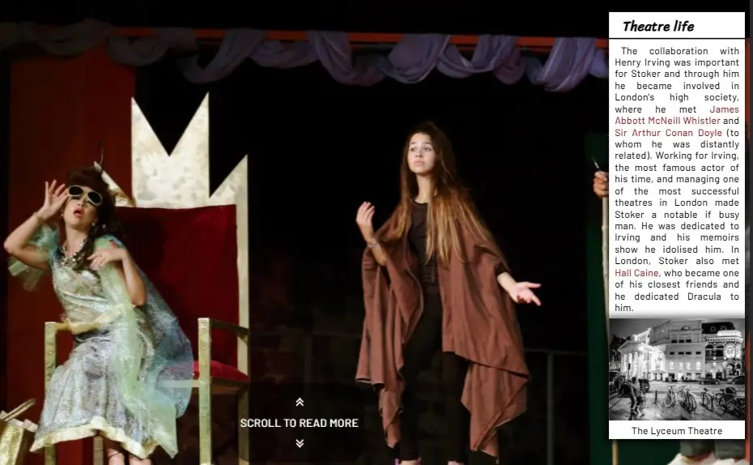
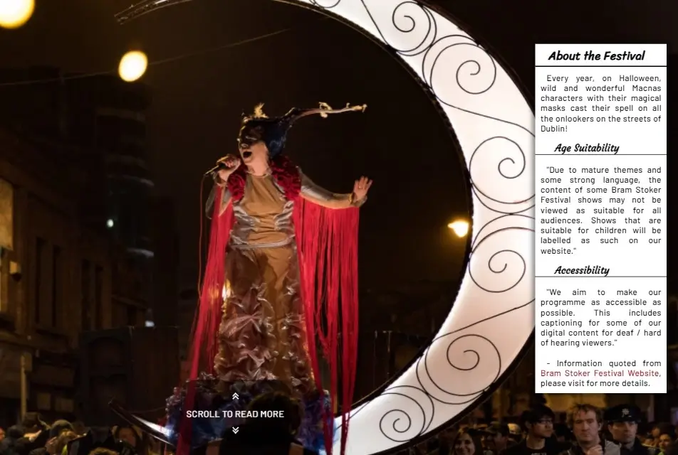

# **Bram Stoker**

## **Website Intro**

Abraham Stoker was an Irish novel writer and a theatre manager, he was the creator of the fantasy novel Dracula as you probably already know or read it on my website (link below). The website aims to educate and offer an introduction into the life of Bram Stoker and his masterpiece creation novel, Dracula. The website also serves as a promotion to Bram Stoker Festival which is celebrated every year in Dublin, Ireland on Halloween. The festival is largely organized by Dublin City Council.

***

**The website is live on Github Pages [Linked Here](https://tiyko.github.io/bram-stoker/index.html)**

***

## **Index**

1. [**Website Intro**](#website-intro)
1. [**Planning**](#planning)
1. [**UX Design**](#ux-design)
    * [**The Strategy and the Scope Plane**](#the-strategy-and-the-scope-plane**)
      * [***Target Audience***](#target-audience)
    * [**The Structure Plane**](#the-structure-plane)
      * [***User Accessibility***](#user-accessibility)
      * [***Website Accomplishments***](#website-accomplishments)
1. [**UI Design**](#ui-design)
    * [**Wireframes**](#wireframes)
    * [**Common Features**](#common-features)
      * [***Colors***](#colors)
      * [***Navigation bar***](#navigation-bar)
      * [***Call to action***](#call-to-action)
      * [***Right side sections***](#right-side-sections)
      * [***Main sections***](#main-sections)
    * [**Page by page Features**](#page-by-page-features)
      * [**Biography - Landing Page**](#biography---landing-page)
      * [**Career page**](#career-page)
        * [***Dracula's story page***](#draculas-story-page)
      * [**Festival page**](#festival-page)
      * [**About page**](#about-page)
        * [***About page form thanks feedback***](#about-page-form-thanks-feedback)
    * [**Footer**](#footer)
1. [**Testing and Debugging**](#testing-and-debugging)
1. [**Deployment**](#deployment)
1. [**Credits and Research**](#credits-and-research)
    * [**Special Credit**](#special-credit)
    * [**Content and Research**](#content-and-research)
    * [**Media**](#media)

***

## **Personal Set Goals**

***Before starting the project I have set a number of set goals with the purpose of learning.***

* The website was built entirely by myself, I didn't use the love running as a template, and only followed instructions from the course walkthrough. Doing it this way, served as a very good practice for me to learn html/css:

  * I planned, to overcomplicate things and learn how to simplify and debug them.
  * I planned, to introduce a greater amount of content.
  * I planned, to make a greater amount of content accessible.
  * I planned, a side navigation bar for larger tablets and desktop size screens.
  * I planned, to have the navigation bar appear on top for small devices (mobile phones, smaller tablets).
  * I planned, wireframes
  * I planned, the Landing page to have an introductive summary with links for people who want a deeper understanding.
  * I planned, the Career page to express general life works and most notable works.
  * I planned, the Festival page to make the user feel well informed and comfortable about the event.
  * I planned, the Contact page to be about the site author, website purpose, and offer credits to the picture authors.

## **UX Design**

*The UXD was made taking into consideration "The Five plans" presented in the course.*

### **The Strategy and the Scope Plane**

* Taking culture into consideration I decided to use an Irish relevant subject:
  * Bram Stoker was one of the most renowned Irish novelists and I think he does not get enough appreciation.
    * An undersaturated product has better chances of selling.
  * Also taking into consideration culture since I am Romanian I grew up with stories about Dracula who Bram Stoker has made popular worldwide with inspiration from Romanian culture.
    * This had a good impact on me as a beginner for research purposes because the subject matters to me.
  * Promoting a local culture product will have a greater impact and thus increase chances of selling the product.

#### ***Target Audience***

* Users that are fans of Bram Stoker's writings.
* Users that are fans of fantasy novels.
* Users that are fans of vampire stories.
* Users that have an interest in festivals and outdoor events.
* Users that live in Dublin and Ireland.
* Users that plan to take a trip to Dublin on Halloween or are tourists.
* Users that maybe are not accustomed to who created Dracula.

### **The Structure Plane**

#### ***User Accessibility***

* As a user, I want the design to be eye-catchy.
* As a user, I want the information to be easy accessed.
* As a user, I want the content of the webpage to be meaningful.
* As a user, I want the content not to be overwhelming.
* As a user, I want the content to have a balance between pictures and text content.
* As a user, I want to have a way to get in touch with the website author and event organizers for feedback or troubleshoot contact.
* As an event organizer, I want the user to be well informed.
* As an event organizer, I want to promote our social media channels.

#### ***Website Accomplishments***

* The website provides, a summary of Bram Stoker's biography and career.
* The website provides, useful links about Bram Stoker's life and most notable works.
* The website provides, links to the image's original location to offer a full-size view and thank the authors.
* The website provides, meaningful information about the festival with pictures, videos, and means of contact with the event organizers.
* The website provides, an all-time present navigation bar to make navigation of content easy to find.
* The website provides, a newsletter system for users to subscribe and receive the latest news.

## **UI Design**

***Taking into consideration the "Five Planes" I have used the "Skeleton Plane" and the "Surface Plane" to make the UI design.***

### **Wireframes**

To follow a pattern and make my life easier before I engaged in creating the website, first I drew wireframes using [draw.io](https://app.diagrams.net/).
I made two sets of wireframes, a top part, and a bottom part because if I were to present these sketches to someone else, they would not know where most of the content resides.

* Desktop wireframes:
  * [Desktop diagram top part](docs/wireframes/initial-desktop-top.png)
  * [Desktop diagram bottom part](docs/wireframes/desktop-bottom-part.png)

* Mobile phones and small tablets:
  * [Small devices diagram](docs/wireframes/initial-phones.png)

After I learned more practical use of HTML/CSS, I decided to make some modifications to the initial wireframes to offer a clearer view into the background image by moving down and off the screen the initial content containers and replace them with a call to action indicator in the bottom part of the screen.

I also learned how to make the aside container display alone on the screen on the initial page load to include it better in the theme along with the background-image.

* New and final wireframe versions:
  * [Desktop diagram top part](docs/wireframes/desktop-top-part.png)
  * [Small devices diagram](docs/wireframes/phones.png)

### **Common Features**

***

#### ***Colors***

* For the colors used on the website, I decided to use variations of dark-red to pink-white on the background of snippets. Black for general content text with orange for links. Pure white for snippets and general content text background.
* As I learned the use CSS better, I decided that I can combine the red color variations in a gradient nice look and feel.
* In the earlier versions of the website I tried to use pure white text over a pure black or reduced opacity background but the look and feel were not satisfying.
* I used the [a11y](https://color.a11y.com/) color validator to make sure the contrast is not out of balance.

#### ***Navigation bar***

* The navigation bar appears on all 6 pages (including dracula_story.html and contact_feedback.html).
* Contains links to Biography, Career, Festival, and About page to facilitate navigation within the website.
* It is fixed to the left side on desktops and larger tablet devices and at the top on mobile phones and smaller tablets, and this way eliminates the need for a "scroll back to top button".
* Each of the four buttons has an animation on hover, fade in and fade out.
* Once a button is pressed will fill in the animation to mark the current page the user is exploring.
* Navigation bar has dark a red image to fit into the vampire theme.

#### ***Call to action***

* On all pages there is a call to action indicator designed to get the attention of the user to take action in scrolling down.
* The indicator is comprised of two symbols (up and down) at the top and bottom with the message "Scroll to read more" between the symbols.
* It has an infinite animation scaling in and out 20%.

#### ***Right side sections***

* On all pages, on the right side, a section related to the current page's content can be found.
* Its purpose is to complement every page's theme.
* It has a title, text content, and pictures.
* Shadows around the edges give it a 3D appearance and make it stand out.

#### ***Main sections***

* On all pages, the article content is delivered in structured sections.
* Each section has a title, paragraphs, and pictures with relevant content.
* Each paragraph and picture sits on a red gradient wall board attached to a white wall plane, with shadows around the edges to give it a 3D feel.

### **Page by page Features**

***

#### **Biography - Landing Page**

* This is the index page, also called the landing page or the home page.
* The page has useful links marked in orange leading to Wikipedia, in case the user wants a more in-depth read.
* Here the user becomes comfortable about the general meaning of the website.
* The large striking background image of a vampire nearby Bran Castle is stating that the website might be about Dracula.
* The side section on the right is meant to complement the background image and assure the user that the website is about Bram Stoker by presenting a short introduction about his life and most notable work, Dracula.

* The large eye-catchy background is meant to also catch the user's attention and make them comfortable to stay and explore the website even if they might not be fans.
* As soon as the user answers the call to action, at the bottom of the screen the user is presented with a concise introduction about Bram Stoker, along with pictures to keep the user entertained.

#### **Career page**

***

* The career page is a summary of Bram Stoker's early career to later in life when he became famous for the immense success of Dracula.
* Theatre was Bram Stoker's life and to emphasize this, the background image tries to make the user immediately understand that is referred to the Theatre.
* The section on the right with the title "Theatre life" complements and seals that this page is referred to a career in Theatre before the user has read any content.

#### ***Dracula's story page***

* At the bottom of the career page, a short introductory section can be found with a link leading to a summary of the book in case the user does not want to read the book, but a summary would suffice.

* This page is complementary to the career page and has a summary of the book in just 9 total sections.
* In addition to Wikipedia links, here the section on right side, there is a section that leads to Wikisource for a full read of Dracula book, in case the user wishes to do so.
* The background image is reverted to the one from the landing page to make the story fit better into the Dracula story theme.

#### **Festival page**

***

* This page aims to promote the festival with striking pictures, videos, and warm quotations from the past years recordings and articles to make the user comfortable and decide to give the festival a try.
* The striking background picture wants to instantly depict a festive feeling.
* The section on the right means to complement the background image and inform the user.

* The videos on this page have a facade to speed up the page's loading time and also the user has the option to load the video on demand if they wish to do so and save resources this way.

#### **About page**

***

* This page offers a means to contact festival organizers via the form on the right-side section.
* The form is made to be simple and intuitive, with a section for username, user contact information, a text area option for feedback, and an option to subscribe to a newsletter system and receive the latest news about future events from the Dublin City Council Events Unit.
* A big stylish button to the bottom of the form inverting colors on hovering, so the user can submit the form after is done.
* Right under the form, a small section presents details in case the user wants to use their own email service to contact the events unit.
* The background represents pretty much my present skills in animation in CSS.
* The skewed element's animation is to start expanding from the top-right corner in diagonal.
* To stick to the theme I have chosen a pinkish gradient color and on top a skewed element with a red gradient background.

* Answering the call to action can read about the website, website author, and its purpose.
* There is a section for credits and research as this website does not have any real affiliation with Dublin City Council and is created for education and learning purposes only.

#### ***About page form thanks feedback***

* After the form is completed and the button is pressed, the form is replaced with a small snippet thanking the user.

### **Footer**

***

* At the bottom of every page, the Footer can be found.
* The title has a red color with a black outline made using text-shadow with a crossing border under it.
* Links to all social media websites related to the festival can be found here with imported icons from css.gg.
* On the left side of it there is a small snippet to follow the author of the website on GitHub.
* It has a stylish gradient background, starting dark red color to a pink whitish color at the end of it.

## **Testing and Debugging**

* During development, I constantly tried to think a couple of steps ahead and tested the website on multiple web browsers to clean it up of errors. Please click on the following .md link for the debugging and performance document [TESTING AND DEBUGGING](TESTING_AND_DEBUGGING.md).

## **Deployment**

To deploy the website on GitHub pages, I used the following procedure:

1. From inside the website's repository I clicked the last tab, "Settings".
1. In the "Settings" tab to the left-hand side a menu with the title "General" can be found. Here in the second group "Code and automation" I clicked the last option, "Pages".
1. Inside "GitHub Pages" and right under it there is a section with the title "Source" with 3 options:
    * Select Branch: main
    * Select Folder: /(root)
    * Click save: your website will be deployed.

## **Credits and Research**

### **Special Credit**

During the developing process, I engaged in the slack community channel project-portfolio-1 with a few questions and received valued feedback:

* [Dick Vlaanderen](https://github.com/dickvla) - my assigned mentor by code institute who has vast experience and a great attitude towards his mentees. Many Thanks to you Sir!
* [David Bowers](https://github.com/dnlbowers) - who offered feedback and tips with a very welcoming attitude and dedication. Especially the guidance I took to write this readme. Many thanks!
* [Simen Daehlin](https://github.com/Eventyret) - who answered on point to the questions I posted on slack.

* ***Also many many thanks to my friend Robert who is already working in the IT industry for Yahoo. He has been answering all my newbie questions and guiding me in great detail to make sure I understand. He is like a mentor and tutor at the same time and I am sure I will continue to abuse his knowledge moving on with the course. Happy to have him as a friend!***

### **General reference:**

Besides the course's material I also used W3schools, MDN web docs, Stack Overflow, and youtube ([Youtube channel WebDevSimplified](https://www.youtube.com/c/WebDevSimplified), [Youtube channel Kevin Powell](https://www.youtube.com/kepowob)) for general or a more in-depth reference.

### **Content and Research**

The content used came from the public domain, and news website articles from where I took and adapted key sections and phrases to fit into my website's theme and deliver a more compact summary:

* All fonts linked from - [Google Fonts](https://fonts.google.com/)
* Icons used in the footer and to the call to action snippet linked from - [css.gg](https://css.gg/)
* Favicon - made using gimp from two letter "V" and two letter "w" (VwwV)

* ***Landing Page / Biography page:***
  * [The Victorian web's Bram Stoker's Biography](https://victorianweb.org/authors/stoker/bio.html)
  * [Wikipedia's Bram Stoker's Biography](https://en.wikipedia.org/wiki/Bram_Stoker)
* ***Career Page:***
  * [Wikipedia's Bram Stoker's Biography](https://en.wikipedia.org/wiki/Bram_Stoker)
  * [Wikipedia's Bram Stoker's Dracula](https://en.wikipedia.org/wiki/Dracula)
  * ***Dracula Story page***
    * [Wikipedia's Bram Stoker's Dracula](https://en.wikipedia.org/wiki/Dracula)
* ***Festival Page:***
  * The content of "Bram Stoker Festival" section and the first paragraphs of "About the Festival" was written by myself to offer a better introduction to the Festival page.
  * Other sections used were inspired or quoted from the following articles:
    * [Bram Stoker Festival Article by RTE](https://www.rte.ie/culture/2016/1026/826978-bram-stoker-festival/)
    * [Bram Stoker Festival Article by Irish Times](https://www.irishtimes.com/culture/bram-stoker-festival-everything-you-need-to-know-1.3666538)
    * [Wikipedia's Article about Macnas artist band](https://en.wikipedia.org/wiki/Macnas)
    * [Shopify community forum Facade SRCDOC Code writen by Ryan-Mathias](https://community.shopify.com/c/technical-q-a/how-to-implement-the-facade-method-for-youtube-embedded-videos/td-p/1287962)
* ***About page:***
  * The content of this page was written by myself.

### **Media**

* ***Landing Page / Biography page:***
  * ***Pictures from [Wikimedia Commons](https://commons.wikimedia.org/wiki/Main_Page):***
    * [Bram Stoker 1906 picture](https://upload.wikimedia.org/wikipedia/commons/3/34/Bram_Stoker_1906.jpg)
    * [Trinity College](https://upload.wikimedia.org/wikipedia/commons/thumb/9/98/Dubl%C3%ADn_-_Trinity_College_-_20170826104457.jpg/2560px-Dubl%C3%ADn_-_Trinity_College_-_20170826104457.jpg)
    * [Golders Green Crematorium](https://upload.wikimedia.org/wikipedia/commons/9/92/Golders_Green_crematorium_%28pictures%29_002.jpg)
    * [Commemorative Plate](https://upload.wikimedia.org/wikipedia/commons/4/40/Stoker_Dublin.jpg)
  * ***Pictures from [William Murphy](https://www.flickr.com/photos/infomatique/):***
    * [Bram Stoker Festival Banner](https://www.flickr.com/photos/80824546@N00/26244661619)
* ***Career Page:***
  * ***Pictures from [Wikimedia Commons](https://commons.wikimedia.org/wiki/Main_Page):***
    * [Dublin Castle](https://upload.wikimedia.org/wikipedia/commons/f/f9/Dublin_Castle_from_the_garden.JPG)
    * [Sir Henry Irving](https://upload.wikimedia.org/wikipedia/commons/1/1b/Sir_Henry_Irving_1899_2.jpg)
    * [The Snake's Pass book](https://upload.wikimedia.org/wikipedia/en/0/0c/TheSnakesPass.jpg)
    * [Dracula book first edition](https://upload.wikimedia.org/wikipedia/commons/b/ba/Dracula1st.jpeg)
    * [Slains Castle in Cruden Bay](https://upload.wikimedia.org/wikipedia/commons/9/9c/SlainsCastleCrudenBay.jpg)
  * ***Pictures from [David Sury](https://www.flickr.com/photos/davidsury/):***
    * [Lyceum Theatre](https://www.flickr.com/photos/davidsury/15611468354/)
  * ***Pictures from [Jesús Corrius](https://www.flickr.com/photos/jcorrius/):***
    * [Drawing of Florence Balcombe](https://www.flickr.com/photos/jcorrius/272617128)
  * ***Pictures from [Henning Supertramp](https://www.flickr.com/photos/hennings_zauberfotos/):***
    * [Dark Castle picture](https://www.flickr.com/photos/hennings_zauberfotos/40495367772/in/photostream/)
  * ***Pictures from [Martin SoulStealer](https://www.flickr.com/photos/soul_stealer/):***
    * [Vamp Trio](https://www.flickr.com/photos/28293006@N05/5478920327)
* ***Dracula Story page:***
  * ***Pictures from [Wikimedia Commons](https://commons.wikimedia.org/wiki/Main_Page):***
    * [Dracula stalks Lucy picture](https://upload.wikimedia.org/wikipedia/commons/6/66/Lupita_Tovar_and_Carlos_Villar%C3%ADas_in_Dracula_%281931_spanish_film%29.jpg)
    * [Seward and Van Hesing](https://upload.wikimedia.org/wikipedia/commons/e/ee/Dracula_1958_e.jpg)
    * [Lucy dies and becomes a vampires picture](https://upload.wikimedia.org/wikipedia/commons/thumb/f/f9/PassionOfDracula2_%2826919182463%29.jpg/1582px-PassionOfDracula2_%2826919182463%29.jpg)
    * [Renfield](https://upload.wikimedia.org/wikipedia/commons/e/ec/Dracula_%281931%29_trailer_-_Renfield.png)
    * [The men discover the coffins picture](https://upload.wikimedia.org/wikipedia/commons/3/31/Triangle_Shirtwaist_coffins.jpg)
    * [Quincey stab Dracula picture](https://upload.wikimedia.org/wikipedia/commons/9/9c/Dracula_%281973%29_-_Nigel_Davenport_2.png)
  * ***Picture from [William Creswell](https://www.flickr.com/photos/crackdog/):***
    * [Dracula sails to England picture](https://www.flickr.com/photos/88645472@N00/13899625988)
  * ***Picture from [Kim](https://www.flickr.com/photos/littlekim/):***
    * [Woman drinking wine](https://www.flickr.com/photos/88761262@N00/219620954)
  * ***Pcture from [Jamiecat *](https://www.flickr.com/photos/jamiecat/):***
    * [Van Helsing cosplay](https://www.flickr.com/photos/27330325@N08/10399844734)
  * ***Picture from [Mark Nockleby](https://www.flickr.com/photos/nocklebeast/):***
    * [Wooden stake and vampire](https://www.flickr.com/photos/95394384@N00/5112018310)
  * ***Picture from [Charles Rodstrom](https://www.flickr.com/photos/partymonstrrrr/):***
    * [...a stake through her heart.](https://www.flickr.com/photos/11454687@N03/2868149940)
* ***Festival Page:***
  * ***Pictures from [William Murphy](https://www.flickr.com/photos/infomatique/):***
    * [Lads with drums](https://www.flickr.com/photos/80824546@N00/21896585423)
    * [Amazing Halloween makeup](https://www.flickr.com/photos/80824546@N00/30697297215)
    * [Macnas's back crow](https://www.flickr.com/photos/80824546@N00/21882224354)
    * [Whistling band](https://www.flickr.com/photos/80824546@N00/30660394066)
    * [Macnas's Witch Lady gigatic puppet](https://www.flickr.com/photos/80824546@N00/30609238991)
  * ***Picture from [BFS Man](https://www.flickr.com/photos/bfs_man/):***
    * [Halloween vampire girl](https://www.flickr.com/photos/bfs_man/27082657169/in/photostream/)
  * ***Videos from [Youtube](https://www.youtube.com/):***
    * [2017 Bram stoker festival](https://www.youtube.com/watch?v=Vo-0HJCtFvk)
    * [A Bram Stoker Tour of Dublin](https://www.youtube.com/watch?v=lzUgbj8HX1k)
    * [Stokerland 2019 | Bram Stoker Festival](https://www.youtube.com/watch?v=QuEIrTpAqqo)
    * [Show at stokerland](https://www.youtube.com/watch?v=vkwWHhxFZDQ)
