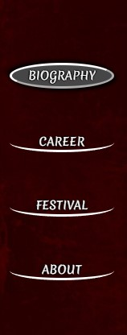
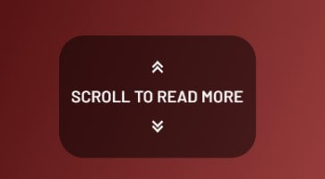

# **Bram Stoker**

## **Website Intro**

Abraham Stoker was an Irish novel writer and a theatre manager, he was the creator of the fantasy novel Dracula as you probably already know or read it on my website (link below). The website aims to educate and offer an introduction into the life of Bram Stoker and his masterpiece creation novel, Dracula. The website also serves as a promotion to Bram Stoker Festival which is celebrated every year in Dublin, Ireland on Halloween. The festival is largely organized by Dublin City Council.

**The website is live on Github Pages [Linked Here](https://tiyko.github.io/bram-stoker/index.html)**

## **Index**

1. [**Website Intro**](#website-intro)
1. [**Planning**](#planning)
1. [**UX Design**](#ux-design)
    * [***Target Audience***](#target-audience)
    * [**User Accessibility**](#user-accessibility)
    * [**Website Accomplishments**](#website-accomplishments)
1. [**UI Design**](#ui-design)
    * [**Wireframes**](#wireframes)

***

## **Planning**

***

* The website served a very good purpose for me to learn html/css:
  * I planned, to overcomplicate things and learn how to simplify and/or debug them.
  * I planned, to introduce a greater amount of content.
  * I planned, to make a greater amount of content accessible.
  * I planned, a side navigation bar for larger tablets and desktop size screens.
  * I planned, to have the navigation bar appear on top for small devices (mobile phones, smaller tablets).
  * I planned, wireframes
  * I planned, the Landing page to have an introductive summary with links for people who want a deeper understanding.
  * I planned, the Career page to express general life works and most notable works.
  * I planned, the Festival page to make the user feel well informed and comfortable about the event.
  * I planned, the Contact page to be about the site author, website purpose, and offer credits to the picture authors.

***

## **UX Design**

***

### **Target Audience**

* Users that are fans of Bram Stoker's writings.
* Users that are fans of fantasy novels.
* Users that are fans of vampire stories.
* Users that have an interest in festivals and outdoor events.
* Users that live in Dublin and Ireland.
* Users that plan to take a trip to Dublin on Halloween or are tourists.
* Users that maybe are not accustomed to who created Dracula.

### **User Accessibility**

* As a user, I want the design to be eye-catchy.
* As a user, I want the information to be easy accessed.
* As a user, I want the content of the webpage to be meaningful.
* As a user, I want the content not to be overwhelming.
* As a user, I want the content to have a balance between pictures and text content.
* As a user, I want to have a way to get in touch with the website author and event organizers for feedback or troubleshoot contact.
* As an event organizer, I want the user to be well informed.
* As an event organizer, I want to promote our social media channels.

### **Website Accomplishments**

* The website provides, a summary of Bram Stoker's biography and career.
* The website provides, useful links about Bram Stoker's life and most notable works.
* The website provides, links to the image's original location to offer a full-size view and thank the authors.
* The website provides, meaningful information about the festival with pictures, videos, and means of contact with the event organizers.
* The website provides, an all-time present navigation bar to make navigation of content easy to find.
* The website provides, a newsletter system for users to subscribe and receive the latest news.

***

## **UI Design**

***

### **Wireframes**

To follow a pattern and make my life easier before I engaged in creating the website, first I drew wireframes using [draw.io](https://app.diagrams.net/).

* Desktop wireframes:
  * [Desktop diagram top part](docs/wireframes/initial-desktop-top.png)
  * [Desktop diagram bottom part](docs/wireframes/desktop-bottom-part.png)

* Mobile phones and small tablets:
  * [Small devices diagram](docs/wireframes/initial-phones.png)

After I learned more practical use of HTML/CSS, I decided to make some modifications to the initial wireframes to offer a clearer view into the background image by moving down and off the screen the initial content containers and replace them with a call to action indicator in the bottom part of the screen.

I also learned how to make the aside container display alone on the screen on the initial page load to include it better in the theme along with the background-image.

* New and final wireframe versions:
  * [Desktop diagram top part](docs/wireframes/desktop-top-part.png)
  * [Small devices diagram](docs/wireframes/phones.png)

### **Common Features**

***

#### ***Navigation bar***

* The navigation bar appears on all 6 pages (including dracula_story.html and contact_feedback.html).
* Contains links to Biography, Career, Festival, and About page to facilitate navigation within the website.
* It is fixed to the left side on desktops and larger tablet devices and at the top on mobile phones and smaller tablets, and this way eliminates the need for a "scroll back to top button".
* Each of the four buttons has an animation on hover, fade in and fade out.
* Once a button is pressed will fill in the animation to mark the current page the user is exploring.
* Navigation bar has dark a red image to fit into the vampire theme.

#### ***Call to action***

* On all pages there is a call to action indicator designed to get the attention of the user to take action in scrolling down.
* The indicator is comprised of two symbols (up and down) at the top and bottom with the message "Scroll to read more" between the symbols.
* It has an infinite animation scaling in and out 20%.

#### ***Right side sections***

* On all pages, a container related to the current page container can be found.
* Its purpose is to compliment every page's theme.
* It has a title, text content, and pictures.
* Shadows around the edges give it a 3D appearance and make it stand out.

#### ***Main sections***

* On all pages, the article content is delivered in structured sections.
* Each section has a title, paragraphs, and pictures with relevant content.
* Each paragraph and picture sits on a red gradient wall board attached to a white wall plane, with shadows around the edges to give it a 3D feel.

### **Biography / Landing Page**

***

* This is the index page, also called the landing page or the home page.
* Here the user becomes comfortable about the general meaning of the website.
* The large striking background image of a vampire nearby Bran Castle is stating that the website might be about Dracula.
* The side section on the right is meant to complement the background image and assure the user that the website is about Bram Stoker by presenting a short introduction about his life and most notable work, Dracula.

* The large eye-catchy background is meant to also catch the user's attention and make them comfortable to stay and explore the website even if they might not be fans.
* As soon as the user answers the call to action, at the bottom of the screen the user is presented with a concise introduction about Bram Stoker, along with pictures to keep the user entertained.

