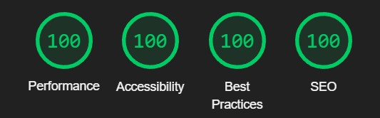
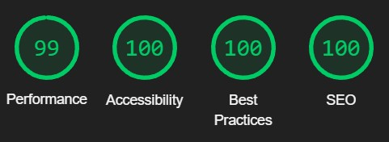

# **Testing and Debugging**

## **Index**

1. [**Development and testing**](#development-and-testing)
1. [**Debugging**](#debugging)
    * [**Issue - The call to action**](#issue---the-call-to-action)
    * [**Issue - The fixed menu and Firefox problem**](#issue---the-fixed-menu-and-firefox-problem)
    * [**Issue - Font-awesome performance errors**](#issue---font-awesome-performance-errors)
    * [**Issue - Youtube videos performance and console errors**](#issue---youtube-videos-performance-and-console-errors)
    * [**Issue - Fixed background-attachment bug**](#issue---fixed-background-attachment-bug)
1. [**Post developement testing**](#post-developement-testing)
    * [**HTML Validation**](#html-validation)
    * [**CSS Validation**](#css-validation)
    * [**Contrast Validation**](#contrast-validation)
1. [**Lighthouse Score**](#lighthouse-score)
    * [***Desktop Lighthouse scores***](#desktop-lighthouse-scores)
    * [***Mobile Phones Lighthouse scores***](#mobile-phones-lighthouse-scores)
1. [**Accessability**](#accessability)

## **Development and testing**

As I better learned practice of HTML and CSS the page went through many changes coming up to this final result:

1. I used developer tools in Brave and Chrome to solve issues and test new changes, and when I would be satisfied, I returned to gitpod and applied the changes, then returned to dev tools to test the changes out to see once again if that is really what I want.
1. I published the page on GitHub pages pretty early in the developing stage so I can share a constant live link to the Slack project-portfolio-1 channel to receive feedback.
1. Shared the website with my experienced friend Robert to get feedback and new ideas on what should I improve further on.
1. I used to test the website on the following web browsers:
    * Brave,
    * Chrome,
    * Firefox,
    * Opera,
    * Safari,
    * Edge.

## **Debugging**

*This is a list of the most notable bugs that were the hardest for me to overcome:*

### **Issue - The call to action**

*Desired outcome: I was looking to have a clear look into the back background image and display as little information as possible on the initial loading on any of the pages:*

#### **Initial solution:**

* I tried to push down the main content containers using margin but that was not satisfying as it was creating responsiveness issues and appeared like the content containers would glitch out.
  * **Issue:** It was making the design appear confusing to the users after I asked a few friends opinions and my mentor sealed it as he was in the same thought as they would not necessarily know what to do until they would actually start exploring. My friend Robert suggests that I have no call to action on the website.

**Final solution:**

* I made a new empty div element to display across the viewport's width and height and in which I nested a small reduced opacity snippet with an indicator calling to the user to take action and scroll for the content appearing hidden from the user on the initial loading of the page. I used flexbox's property justify-content flex-end in a flex-direction column to move the snippet to the bottom of the div.
* I applied a similar concept to the aside element but used flexbox's align items center property instead.
* Now both containers would display like intended and be responsive.
  * Although this solution cascaded into another issue where the form on the About page would appear squished without having any margin or padding added to create issues.
  * The solution was simple, I only used width 100% and had it spread to the width of the parent container.

***

### **Issue - The fixed menu and Firefox problem**

*Desired outcome: To have the menu bar fixed to the left side on desktops, laptops, and larger tablets and fixed to the top on smaller devices such as phones and smaller tablets:*

**Initial solution:**

* I tried using a position sticky.
  * The outcome was less than desirable on desktops, as it would appear to glitch out during scrolling up and down and on mobile would keep disappearing, and in my opinion that is an unnecessary distraction.

**Final solution:**

* Position fixed did that very well. This cascaded in another problem and make the menu come out of the parent container that was nested in so i had to give it more precise rules.
* Although this solution was perfect using Chrome browser and Brave browser, while checking on Firefox browser the picture on the background would spill out of the parent container while navigating the About page on both desktops and mobile phones.
  * Solution was simple. I have used a fixed viewport width on the parent container and after testing it out it behaved very well and was responsive on all browsers. Overflow:hidden didn't work.

***

### **Issue - Font-awesome performance errors**

*Desired outcome: To have no performance errors or reduce their impact from font-awesome CDNs:*

**Solution:**

* After running a few performance tests, The lighthouse was pointing to the errors "first contentful paint" and "eliminate render-blocking resources" and also W3C CSS validator was showing some errors.
* I went to read the error's documentation and then decided to go on a google search and found out the problem is shared between the Lighthouse and Font-awesome CDNs.
* I tried multiple versions of font-awesome and the problem persisted.
* I decided to get rid of font-awesome altogether as to me errors are not so awesome. After a google search, I found a couple of alternatives to font awesome and went ahead and used css.gg instead.

***

### **Issue - Youtube videos performance and console errors**

*Desired outcome: To have no performance errors or reduce their impact from Youtube embed videos:*

**Solution:**

* After running a few performance tests, The lighthouse was pointing out errors in the console and an increased load time for up to 5 seconds on the festival page.
* I went to read the error's documentation and it was pointing out that a facade in front of the videos could fix the issue.
* Not knowing what a facade is, I went on a google search and found an example of a facade on a Shopify forum.
* I took the "srcdoc" and formatted it to understand better how to use the facade's code. After doing so I adapted it to fit my needs.
* Went back to the lighthouse and ran a few tests and just like that the errors were gone.

***

### **Issue - Fixed background-attachment bug**

*Desired outcome: To have the background pictures display well on Safari based devices as it would appear stretched or not at all:*

**Initial solution:**

* I discovered that the background-attachment fixed was the problem by using dev tools and my friend's iPhone.
* I went on a google search and discovered that there is a known bug on background-attachment fixed and scroll on Safari, Opera, and Android browsers.
* I tried to alter the values of the background property and avoid background-attachment fixed but nothing would be desirable on a responsive level.

**Solution:**

* I decided to stop using the background property and migrate my background image to my HTML files.
* After reading about the img element on w3c schools I found out about the srcset property, but altering only the same image would not be desirable.
* I went on further google search and discovered the picture element and after reading its documentation this seemed to be the best option.
* I went ahead and altered my images using GIMP, and then by using the picture element and its sources I set up media break-points and finally got a desirable outcome.

***

*These are the most notable errors I confronted with and I stopped the error/bug list over here as classical simple problems such as centering divs were not a real problem to me. I am no expert in only in just 2 months by no means but so far I think I came a long way.*

*I could as well include over here that after the testing and debugging phase was done I went into all my files and tried to dry up my code, especially the CSS file and found about 3 syntaxes that have been simplified and also in the HTML files I removed the div wrapping all the content of the pages and gave its values to the body element.*

## **Post developement testing**

### **HTML Validation**

* To test all my pages I used [W3C HTML Validator](https://validator.w3.org/nu/) throughout my whole development the only errors I had to fix were the article's sections related error related to the lack of titles. After I fixed this issue and properly grouped my sections to fall under a title all errors were gone and the validator returned without errors.

* After I split into two pages the Career page and created the Dracula story page, shocking errors in the HTML validator again as I left the new article without a header. To fix this I transformed the first section which was already read by the user previously into a header and gave the rest of the content a title of "Continued". This way would make the user be more present on the page and know where they left off reading and also fixed the HTML errors at the same time.

### **CSS Validation**

* To test my CSS code I used [W3C Jigsaw CSS Validator](https://jigsaw.w3.org/css-validator/) with no errors returned.

### **Contrast Validation**

* To make sure I had no contrast issues with my colors as I picked myself without using a palletee I went and found on a google search ["a11y Color Contrast Accessibility Validator"](https://color.a11y.com/).
* After I ran my pages through it I discovered that the links of the content were having contrast issues.
* I went into my CSS file adjusted the code to a darker shade and the issue was fixed.

## **Lighthouse Score**

* During development, I used the Lighthouse now and then to make sure my website performance score stays as high up as possible but there were a few errors I had to fix:
  * No meta description was severely cutting down points. After I have add the line in the head the error went away.
  * Large pictures impact severely the scores so I used GIMP to resize and crop the pictures. New-gen picture formats helped further on and I used webp format on most of my pictures.
  * No ALT description within the img elements was causing performance drops. I went and add an ALT description to all my img elements.

### ***Desktop Lighthouse scores***

### ***Mobile Phones Lighthouse scores***

*These scores came up most often but because the website has to contact other third party websites like linked fonts and icons, there seemed to be some variation if I would run the same test many times in a row. I used incognito mode on Brave and Chrome to run the Lighthouse tests. However, Opera browser Lighthouse tests showed results most consistent and stable.*

## **Accessability**

After using [WAVE - Web accessability evaluation tool](https://wave.webaim.org/) the only warning I got is for using text indent, which I intended it like that.

***

**[Click here to return back to the README.md](README.md)**

***
